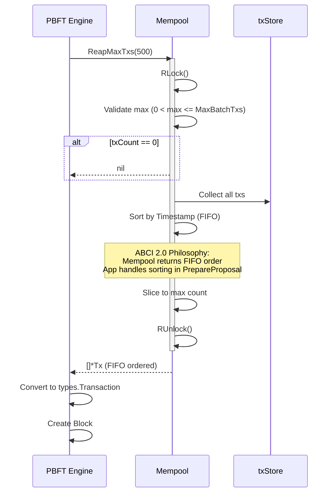

# PBFT-Cosmos 아키텍처 및 코드 플로우

## 목차
1. [시스템 아키텍처](#1-시스템-아키텍처)
2. [노드 시작 플로우](#2-노드-시작-플로우)
3. [트랜잭션 제출 플로우](#3-트랜잭션-제출-플로우)
4. [PBFT 합의 플로우](#4-pbft-합의-플로우)
5. [블록 실행 및 커밋 플로우](#5-블록-실행-및-커밋-플로우)
6. [뷰 체인지 플로우](#6-뷰-체인지-플로우)
7. [Mempool 플로우](#7-mempool-플로우)
8. [네트워크 통신 플로우](#8-네트워크-통신-플로우)
9. [ABCI 2.0 통합 플로우](#9-abci-20-통합-플로우)
10. [메트릭 수집 플로우](#10-메트릭-수집-플로우)

---

## 1. 시스템 아키텍처

### 1.1 전체 시스템 구조


### 1.2 패키지 의존성


---

## 2. 노드 시작 플로우

### 2.1 CLI에서 노드 시작


### 2.2 노드 내부 초기화 상세


---

## 3. 트랜잭션 제출 플로우

### 3.1 클라이언트 트랜잭션 제출


### 3.2 Mempool 트랜잭션 저장 구조

```mermaid
flowchart TB
    subgraph "Mempool Storage"
        subgraph "txStore (map[string]*Tx)"
            TX1[hash1 -> Tx1]
            TX2[hash2 -> Tx2]
            TX3[hash3 -> Tx3]
            TX4[hash4 -> Tx4]
        end

        subgraph "senderIndex (map[string][]*Tx)"
            SA[senderA -> Tx1, Tx3]
            SB[senderB -> Tx2, Tx4]
        end

        subgraph "State"
            Count[txCount: 4]
            Bytes[txBytes: 1024]
            Height[height: 100]
        end
    end

    subgraph "Tx Structure"
        TxObj[Tx]
        TxObj --> Hash[Hash: []byte]
        TxObj --> ID[ID: string]
        TxObj --> Data[Data: []byte]
        TxObj --> Sender[Sender: string]
        TxObj --> Nonce[Nonce: uint64]
        TxObj --> GasPrice[GasPrice: uint64]
        TxObj --> Timestamp[Timestamp: time.Time]
    end
```

---

## 4. PBFT 합의 플로우

### 4.1 전체 PBFT 합의 프로토콜


### 4.2 Engine 내부 메시지 처리


### 4.3 상태 전이 다이어그램


### 4.4 StateLog 구조


---

## 5. 블록 실행 및 커밋 플로우

### 5.1 블록 실행 상세


### 5.2 체크포인트 생성

```mermaid
flowchart TD
    subgraph "createCheckpoint(seqNum)"
        A[Lock mutex]
        A --> B{committedBlocks exists?}
        B --> |Yes| C[Get last block hash]
        C --> D[checkpoints[seqNum] = hash]
        B --> |No| D

        D --> E{len(checkpoints) > 3?}
        E --> |Yes| F[Find oldest checkpoint]
        F --> G[Delete oldest]
        G --> H[Unlock mutex]
        E --> |No| H

        H --> I[stateLog.AdvanceWatermarks]
        I --> J[Log checkpoint created]
    end

    subgraph "AdvanceWatermarks"
        K[Update LowWaterMark]
        K --> L[Remove old states]
        L --> M[Update HighWaterMark]
    end
```

---

## 6. 뷰 체인지 플로우

### 6.1 뷰 체인지 트리거


### 6.2 뷰 체인지 메시지 처리


### 6.3 NEW-VIEW 메시지 처리


### 6.4 뷰 체인지 상태 다이어그램


---

## 7. Mempool 플로우

### 7.1 트랜잭션 라이프사이클


### 7.2 ReapMaxTxs 플로우



### 7.3 Mempool Update 플로우


### 7.4 백그라운드 작업


---

## 8. 네트워크 통신 플로우

### 8.1 gRPC Transport 구조

```mermaid
flowchart TB
    subgraph "GRPCTransport"
        subgraph "Server Side"
            Server[grpc.Server]
            Listener[net.Listener]
            Service[PBFTServiceServer]
        end

        subgraph "Client Side"
            Peers[peers map]
            PC1[peerConn: node1]
            PC2[peerConn: node2]
            PC3[peerConn: node3]
        end

        subgraph "Handlers"
            MsgHandler[msgHandler func]
            StateProvider[stateProvider]
        end
    end

    Server --> Service
    Listener --> Server

    Peers --> PC1
    Peers --> PC2
    Peers --> PC3

    Service --> MsgHandler
    Service --> StateProvider
```

### 8.2 메시지 브로드캐스트 플로우

```mermaid
sequenceDiagram
    participant Engine as PBFT Engine
    participant Transport as GRPCTransport
    participant Peer1 as Peer Node 1
    participant Peer2 as Peer Node 2
    participant Peer3 as Peer Node 3

    Engine->>Transport: Broadcast(msg)

    activate Transport
    Transport->>Transport: RLock peers
    Transport->>Transport: Copy peer list
    Transport->>Transport: RUnlock

    Transport->>Transport: messageToProto(msg)

    par Parallel broadcast
        Transport->>Peer1: BroadcastMessage(request)
        Transport->>Peer2: BroadcastMessage(request)
        Transport->>Peer3: BroadcastMessage(request)
    end

    Peer1-->>Transport: BroadcastResponse
    Peer2-->>Transport: BroadcastResponse
    Peer3-->>Transport: BroadcastResponse

    Transport->>Transport: Collect errors
    deactivate Transport

    Transport-->>Engine: lastErr or nil
```

### 8.3 메시지 수신 플로우

```mermaid
sequenceDiagram
    participant RemoteNode as Remote Node
    participant Server as gRPC Server
    participant Transport as GRPCTransport
    participant Handler as msgHandler
    participant Engine as PBFT Engine

    RemoteNode->>Server: BroadcastMessage(request)
    Server->>Transport: BroadcastMessage(ctx, req)

    activate Transport
    Transport->>Transport: Check msgHandler exists
    Transport->>Transport: protoToMessage(req.Message)
    Transport->>Handler: msgHandler(msg)
    deactivate Transport

    Handler->>Engine: handleIncomingMessage(msg)

    activate Engine
    Engine->>Engine: msgChan <- msg
    Note over Engine: Non-blocking send<br/>Drop if channel full
    deactivate Engine

    Transport-->>Server: BroadcastResponse{Success: true}
    Server-->>RemoteNode: Response
```

### 8.4 상태 동기화 플로우

```mermaid
sequenceDiagram
    participant NewNode as New Node
    participant Transport as GRPCTransport
    participant StateProvider as StateProvider (Engine)
    participant ExistingNode as Existing Node

    NewNode->>Transport: SyncState(fromHeight)

    activate Transport
    Transport->>Transport: RLock stateProvider
    Transport->>StateProvider: GetBlocksFromHeight(fromHeight)
    StateProvider-->>Transport: []*types.Block

    Transport->>StateProvider: GetCheckpoints()
    StateProvider-->>Transport: []Checkpoint
    Transport->>Transport: RUnlock

    Transport->>Transport: Convert to proto
    deactivate Transport

    Transport-->>NewNode: SyncStateResponse{Blocks, Checkpoints}

    NewNode->>NewNode: Apply blocks
    NewNode->>NewNode: Update checkpoints
```

---

## 9. ABCI 2.0 통합 플로우

### 9.1 ABCI 메서드 호출 흐름

```mermaid
flowchart TD
    subgraph "Consensus Flow with ABCI 2.0"
        A[New Block Proposal] --> B[PrepareProposal]
        B --> C[Broadcast PRE-PREPARE]
        C --> D[Receive PRE-PREPARE]
        D --> E[ProcessProposal]
        E --> F{Accept?}
        F --> |No| G[Reject Block]
        F --> |Yes| H[Continue PBFT]
        H --> I[Prepare Phase]
        I --> J[Commit Phase]
        J --> K[FinalizeBlock]
        K --> L[Commit]
        L --> M[Block Finalized]
    end
```

### 9.2 PrepareProposal 상세

```mermaid
sequenceDiagram
    participant Engine as PBFT Engine
    participant Adapter as ABCIAdapter
    participant Client as ABCI Client
    participant App as Cosmos SDK App

    Note over Engine: Primary proposing block

    Engine->>Engine: Collect txs from Mempool
    Engine->>Adapter: PrepareProposal(ctx, height, proposer, txs)

    activate Adapter
    Adapter->>Adapter: Create PrepareProposalRequest
    Note over Adapter: txs, maxTxBytes, height,<br/>time, proposerAddr

    Adapter->>Client: PrepareProposal(ctx, req)
    Client->>App: gRPC PrepareProposal

    App->>App: Filter/Reorder txs
    App->>App: Apply MEV protection
    App->>App: Check tx validity

    App-->>Client: PrepareProposalResponse{Txs}
    Client-->>Adapter: response
    deactivate Adapter

    Adapter-->>Engine: filteredTxs, nil

    Engine->>Engine: Create block with filtered txs
```

### 9.3 ProcessProposal 상세

```mermaid
sequenceDiagram
    participant Engine as PBFT Engine
    participant Adapter as ABCIAdapter
    participant Client as ABCI Client
    participant App as Cosmos SDK App

    Note over Engine: Replica received PRE-PREPARE

    Engine->>Adapter: ProcessProposal(ctx, height, proposer, txs, hash)

    activate Adapter
    Adapter->>Adapter: Create ProcessProposalRequest

    Adapter->>Client: ProcessProposal(ctx, req)
    Client->>App: gRPC ProcessProposal

    App->>App: Validate block structure
    App->>App: Verify txs are valid
    App->>App: Check proposer

    alt Valid Block
        App-->>Client: ACCEPT
    else Invalid Block
        App-->>Client: REJECT
    end

    Client-->>Adapter: response
    deactivate Adapter

    Adapter-->>Engine: accepted (bool), nil

    alt Accepted
        Engine->>Engine: Continue with PREPARE
    else Rejected
        Engine->>Engine: Ignore block
    end
```

### 9.4 FinalizeBlock 상세

```mermaid
sequenceDiagram
    participant Engine as PBFT Engine
    participant Adapter as ABCIAdapter
    participant Client as ABCI Client
    participant App as Cosmos SDK App

    Note over Engine: Block committed (2f+1 COMMITs)

    Engine->>Adapter: FinalizeBlock(ctx, block)

    activate Adapter
    Adapter->>Adapter: Extract txs from block
    Adapter->>Adapter: Create BlockData
    Adapter->>Adapter: Create FinalizeBlockRequest

    Adapter->>Client: FinalizeBlock(ctx, req)
    Client->>App: gRPC FinalizeBlock

    App->>App: BeginBlock logic

    loop For each tx
        App->>App: DeliverTx logic
        App->>App: Execute state changes
        App->>App: Collect events
    end

    App->>App: EndBlock logic
    App->>App: Validator updates
    App->>App: Consensus param updates

    App-->>Client: FinalizeBlockResponse
    Note over Client: TxResults, ValidatorUpdates,<br/>ConsensusParamUpdates, AppHash, Events

    Client-->>Adapter: response
    Adapter->>Adapter: Convert to ABCIExecutionResult
    deactivate Adapter

    Adapter-->>Engine: result, nil

    Engine->>Engine: Handle validator updates
    Engine->>Engine: Store app hash
```

### 9.5 Commit 플로우

```mermaid
sequenceDiagram
    participant Engine as PBFT Engine
    participant Adapter as ABCIAdapter
    participant Client as ABCI Client
    participant App as Cosmos SDK App

    Engine->>Adapter: Commit(ctx)

    activate Adapter
    Adapter->>Client: Commit(ctx)
    Client->>App: gRPC Commit

    App->>App: Persist state to disk
    App->>App: Calculate app hash
    App->>App: Cleanup

    App-->>Client: CommitResponse{RetainHeight}
    Client-->>Adapter: response

    Adapter->>Adapter: Increment lastHeight
    deactivate Adapter

    Adapter-->>Engine: appHash, retainHeight, nil
```

---

## 10. 메트릭 수집 플로우

### 10.1 메트릭 구조

```mermaid
flowchart TB
    subgraph "Metrics Collection Points"
        subgraph "Consensus Metrics"
            CR[consensusRoundsTotal]
            CD[consensusDuration]
            BH[currentBlockHeight]
            CV[currentView]
            VC[viewChangesTotal]
        end

        subgraph "Message Metrics"
            MS[messagesSentTotal]
            MR[messagesReceivedTotal]
            MP[messageProcessingTime]
        end

        subgraph "Block Metrics"
            BE[blockExecutionTime]
            TT[transactionsTotal]
            TPS[tps]
        end
    end

    subgraph "Collection Sources"
        Engine[PBFT Engine]
        Transport[Transport]
        Node[Node]
    end

    Engine --> CR
    Engine --> CD
    Engine --> BH
    Engine --> CV
    Engine --> VC
    Engine --> BE
    Engine --> TT
    Engine --> TPS
    Engine --> MS
    Engine --> MR
    Engine --> MP
```

### 10.2 메트릭 수집 타이밍

```mermaid
sequenceDiagram
    participant Engine as PBFT Engine
    participant Metrics as Metrics
    participant Prometheus as Prometheus Server

    Note over Engine: Consensus Round Start
    Engine->>Metrics: StartConsensusRound(seqNum)
    Metrics->>Metrics: roundStartTimes[seqNum] = now

    Note over Engine: Message Sent
    Engine->>Metrics: IncrementMessagesSent(msgType)

    Note over Engine: Message Received
    Engine->>Metrics: IncrementMessagesReceived(msgType)
    Engine->>Metrics: RecordMessageProcessingTime(msgType, duration)

    Note over Engine: View Change
    Engine->>Metrics: IncrementViewChanges()
    Engine->>Metrics: SetCurrentView(newView)

    Note over Engine: Block Executed
    Engine->>Metrics: EndConsensusRound(seqNum)
    Metrics->>Metrics: Calculate duration
    Metrics->>Metrics: consensusDuration.Observe()
    Metrics->>Metrics: consensusRoundsTotal.Inc()

    Engine->>Metrics: SetBlockHeight(height)
    Engine->>Metrics: RecordBlockExecutionTime(duration)
    Engine->>Metrics: AddTransactions(count)

    Prometheus->>Metrics: GET /metrics
    Metrics-->>Prometheus: Prometheus format metrics
```

### 10.3 Prometheus Exposition

```mermaid
flowchart TD
    subgraph "Metrics Server"
        HTTP[HTTP Server :26660]

        subgraph "Endpoints"
            ME[/metrics]
            HE[/health]
            SE[/status]
        end
    end

    subgraph "Prometheus Format Output"
        M1["pbft_consensus_rounds_total 150"]
        M2["pbft_consensus_duration_seconds{quantile='0.5'} 0.5"]
        M3["pbft_block_height 1500"]
        M4["pbft_current_view 3"]
        M5["pbft_messages_sent_total{type='PrePrepare'} 150"]
        M6["pbft_messages_received_total{type='Prepare'} 450"]
        M7["pbft_view_changes_total 3"]
        M8["pbft_tps 100"]
    end

    HTTP --> ME
    HTTP --> HE
    HTTP --> SE

    ME --> M1
    ME --> M2
    ME --> M3
    ME --> M4
    ME --> M5
    ME --> M6
    ME --> M7
    ME --> M8
```

---

## 부록: 타입 참조

### 핵심 타입

```mermaid
classDiagram
    class Node {
        +Config config
        +Engine engine
        +GRPCTransport transport
        +Mempool mempool
        +Reactor reactor
        +Metrics metrics
        +Start(ctx) error
        +Stop() error
        +SubmitTx(tx, clientID) error
    }

    class Engine {
        +Config config
        +uint64 view
        +uint64 sequenceNum
        +ValidatorSet validatorSet
        +StateLog stateLog
        +Transport transport
        +Mempool mempool
        +Start() error
        +Stop()
        +SubmitRequest(op, clientID) error
        +IsPrimary() bool
    }

    class Mempool {
        +Config config
        +map txStore
        +map senderIndex
        +Start() error
        +Stop() error
        +AddTx(tx) error
        +ReapMaxTxs(max) []*Tx
        +Update(height, txs) error
    }

    class GRPCTransport {
        +string nodeID
        +grpc.Server server
        +map peers
        +Start() error
        +Stop()
        +Broadcast(msg) error
        +Send(nodeID, msg) error
    }

    class State {
        +uint64 View
        +uint64 SequenceNum
        +StatePhase Phase
        +PrePrepareMsg PrePrepareMsg
        +Block Block
        +map PrepareMsgs
        +map CommitMsgs
        +IsPrepared(quorum) bool
        +IsCommitted(quorum) bool
    }

    Node --> Engine
    Node --> Mempool
    Node --> GRPCTransport
    Engine --> State
    Engine --> Mempool
    Engine --> GRPCTransport
```

### 메시지 타입

```mermaid
classDiagram
    class Message {
        +MessageType Type
        +uint64 View
        +uint64 SequenceNum
        +[]byte Digest
        +string NodeID
        +time.Time Timestamp
        +[]byte Signature
        +[]byte Payload
    }

    class PrePrepareMsg {
        +uint64 View
        +uint64 SequenceNum
        +[]byte Digest
        +Block Block
        +string PrimaryID
    }

    class PrepareMsg {
        +uint64 View
        +uint64 SequenceNum
        +[]byte Digest
        +string NodeID
    }

    class CommitMsg {
        +uint64 View
        +uint64 SequenceNum
        +[]byte Digest
        +string NodeID
    }

    class ViewChangeMsg {
        +uint64 NewView
        +uint64 LastSeqNum
        +[]Checkpoint Checkpoints
        +[]PreparedCert PreparedSet
        +string NodeID
    }

    class NewViewMsg {
        +uint64 View
        +[]ViewChangeMsg ViewChangeMsgs
        +[]PrePrepareMsg PrePrepareMsgs
        +string NewPrimaryID
    }

    Message <|-- PrePrepareMsg
    Message <|-- PrepareMsg
    Message <|-- CommitMsg
    Message <|-- ViewChangeMsg
    Message <|-- NewViewMsg
```
