# PBFT 합의 코드 플로우 (Mermaid 다이어그램)

## 1. PBFT 합의 전체 흐름

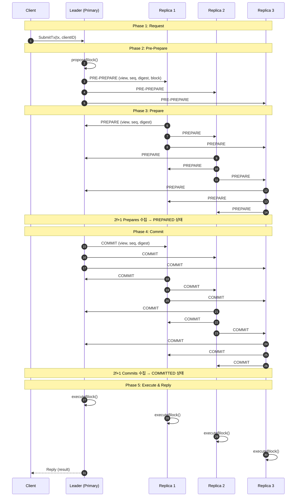

---

## 2. 단계별 상세 코드 플로우

### 2.1 Phase 1: Request (트랜잭션 제출)

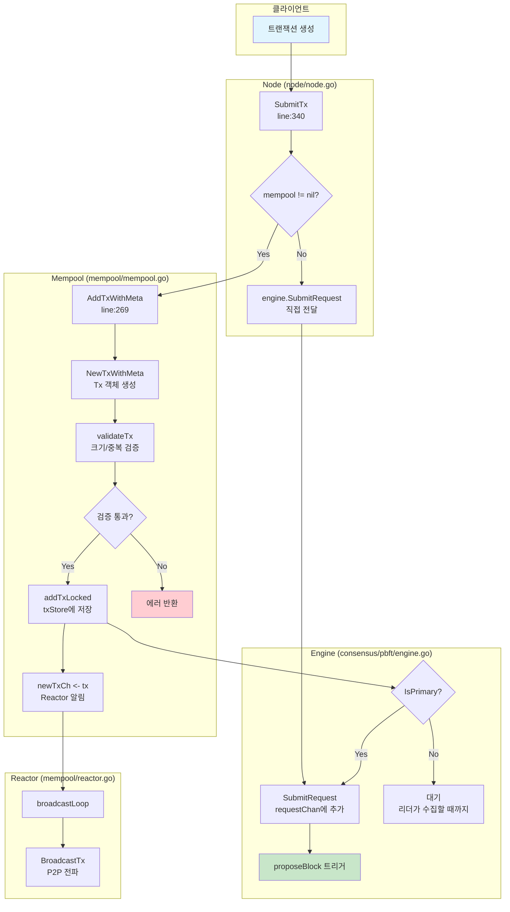

**코드 경로 상세:**

```mermaid
flowchart LR
    subgraph "node/node.go:340-357"
        A["SubmitTx(tx []byte, clientID string)"]
    end

    subgraph "mempool/mempool.go:269-344"
        B["AddTxWithMeta()"]
        B1["1. 크기 체크 (MaxTxBytes)"]
        B2["2. Tx 생성 (NewTxWithMeta)"]
        B3["3. 중복 체크 (txStore)"]
        B4["4. 최근 제거 체크"]
        B5["5. 가스 가격 체크"]
        B6["6. Nonce 체크"]
        B7["7. CheckTx 콜백"]
        B8["8. 용량 체크/퇴출"]
        B9["9. 저장 (addTxLocked)"]
        B10["10. 알림 (newTxCh)"]
    end

    A --> B
    B --> B1 --> B2 --> B3 --> B4 --> B5 --> B6 --> B7 --> B8 --> B9 --> B10
```

---

### 2.2 Phase 2: Pre-Prepare (블록 제안)

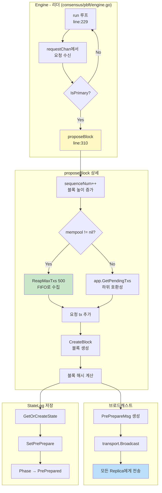

**Mempool에서 트랜잭션 수집:**

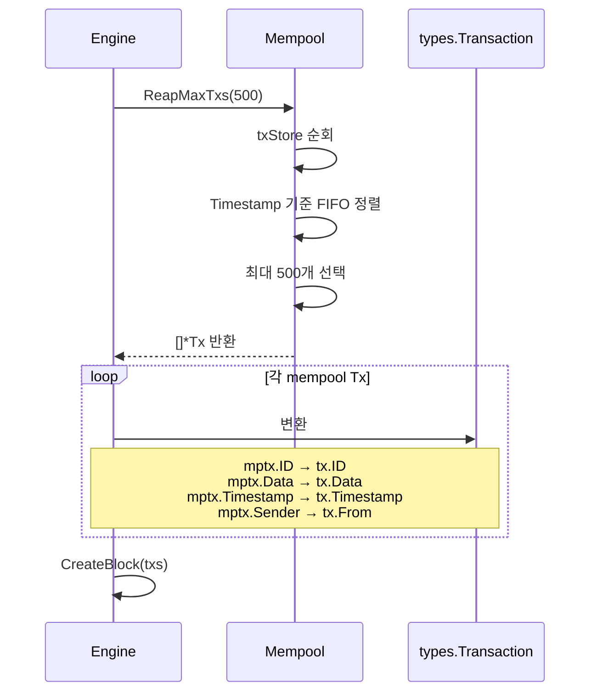

---

### 2.3 Phase 3: Prepare (투표)

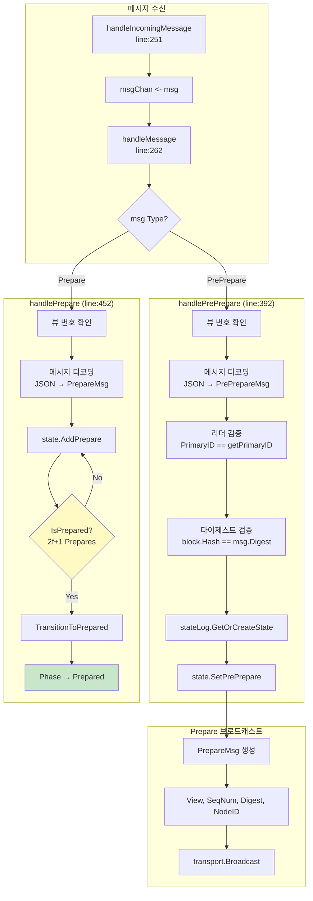

**Prepare 쿼럼 확인:**

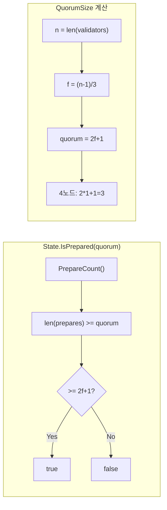

---

### 2.4 Phase 4: Commit (확정)

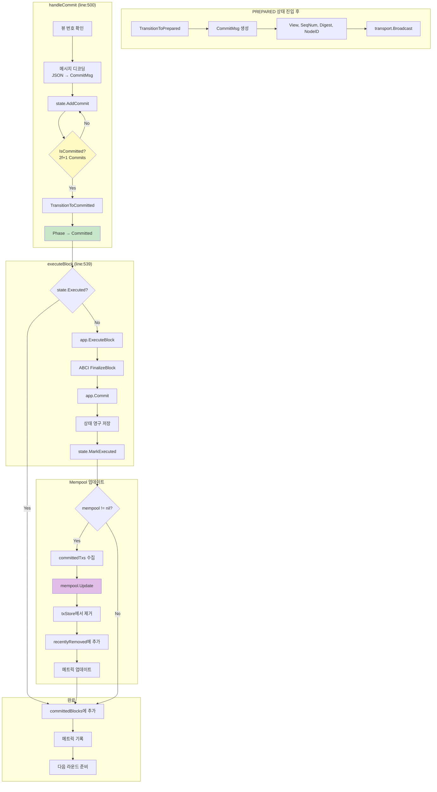

**블록 실행 상세:**

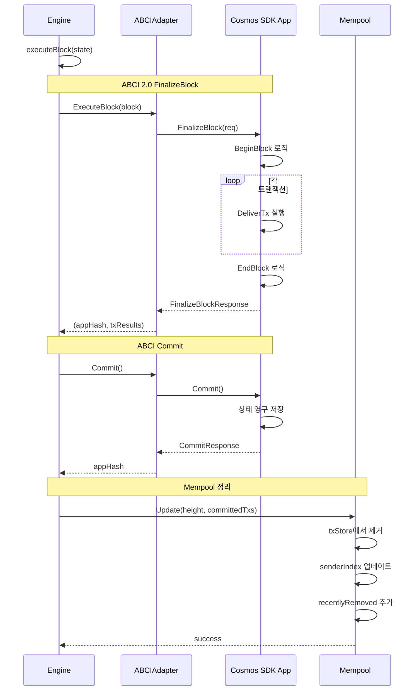

---

## 3. View Change 프로토콜

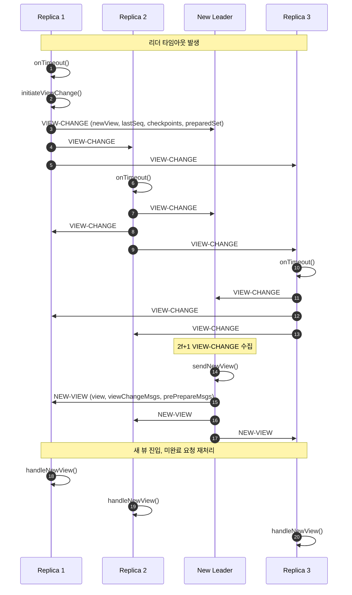

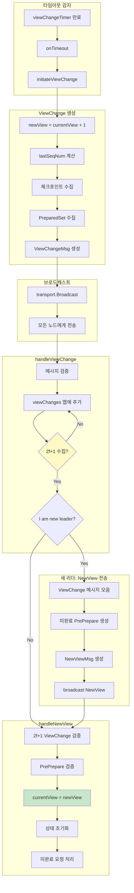

---

## 4. Checkpoint 프로토콜

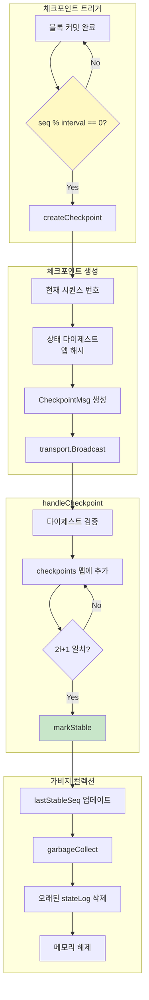

---

## 5. 합의 상태 전이 다이어그램

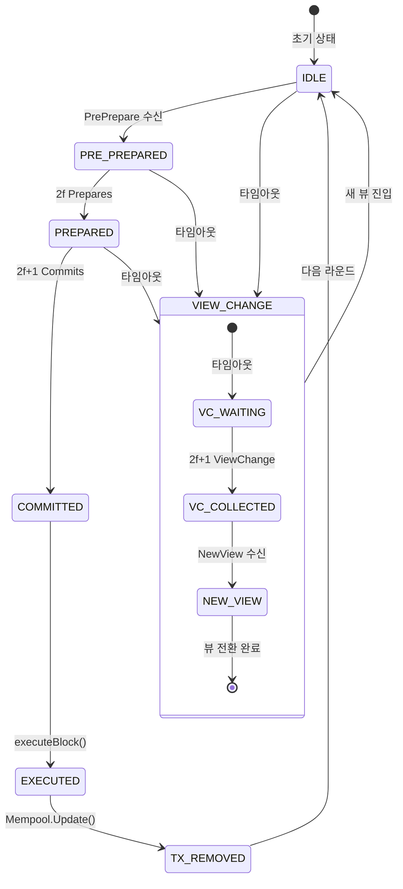

**Phase 상세:**

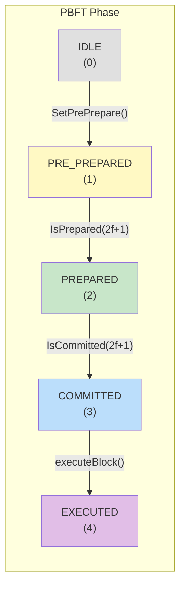

---

## 6. Mempool 연동 플로우

### 6.1 트랜잭션 진입

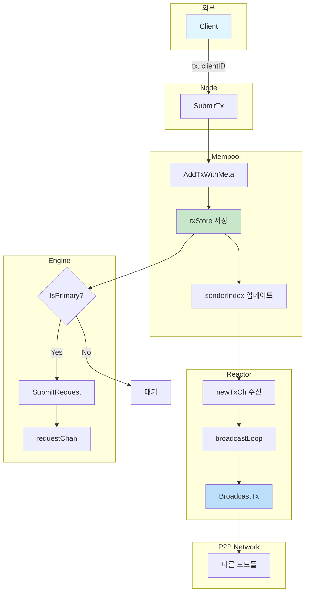

### 6.2 블록 제안 시 트랜잭션 수집

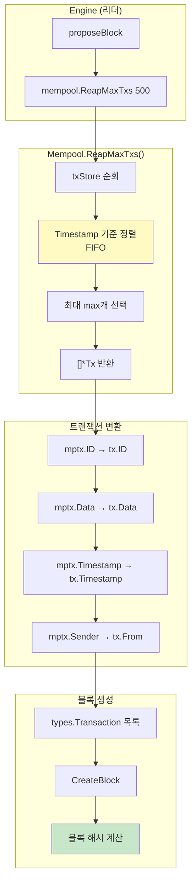

### 6.3 블록 커밋 후 정리

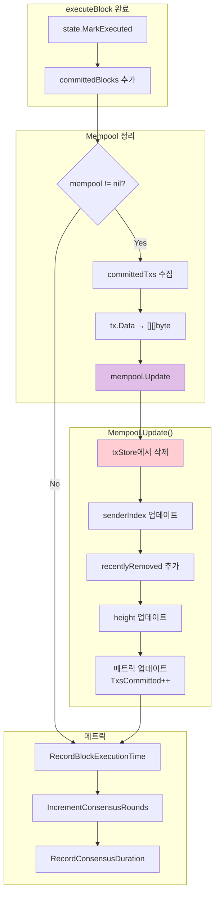

---

## 7. 메시지 처리 플로우

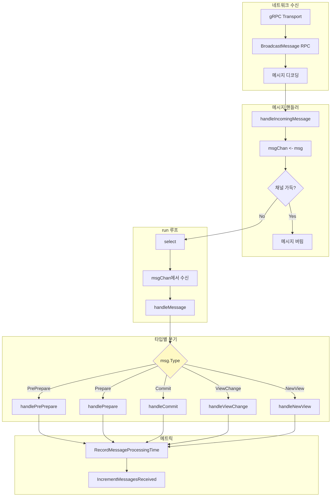

---

## 8. 쿼럼 요구사항

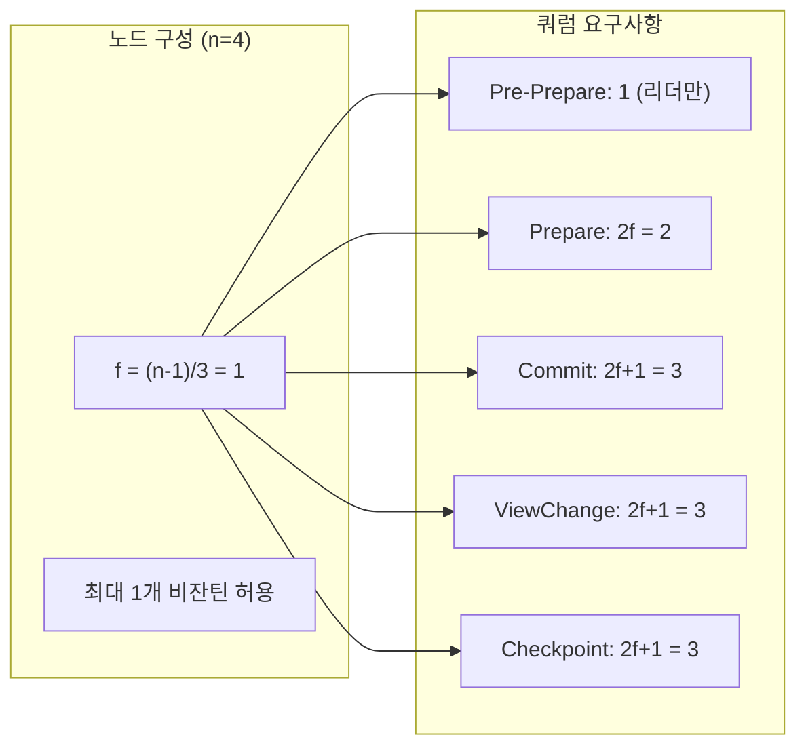

| 단계 | 필요 메시지 수 | 4노드 | 7노드 | 10노드 |
|------|--------------|-------|-------|--------|
| Pre-Prepare | 1 | 1 | 1 | 1 |
| Prepare | 2f | 2 | 4 | 6 |
| Commit | 2f+1 | 3 | 5 | 7 |
| View Change | 2f+1 | 3 | 5 | 7 |
| Checkpoint | 2f+1 | 3 | 5 | 7 |

---

## 9. 주요 함수 참조

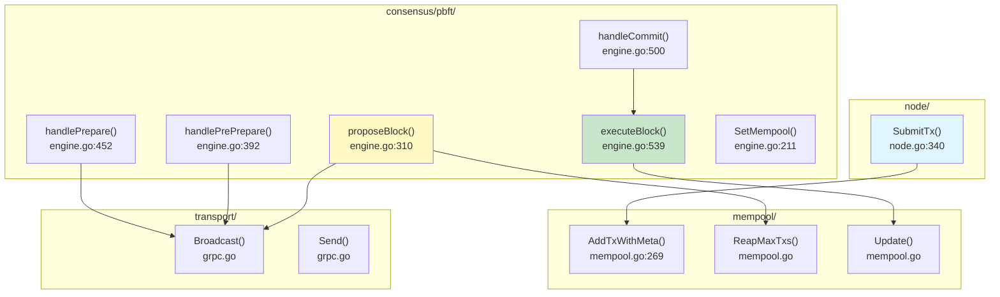

---

## 10. 전체 시스템 아키텍처

```mermaid
flowchart TB
    subgraph Client["클라이언트"]
        A[Transaction]
    end

    subgraph Node["PBFT Node"]
        subgraph Components["컴포넌트"]
            B[Node]
            C[Engine]
            D[Mempool]
            E[Reactor]
            F[Transport]
            G[Metrics]
        end

        subgraph ABCI["ABCI 2.0"]
            H[ABCIAdapter]
        end
    end

    subgraph App["Cosmos SDK App"]
        I[Application]
    end

    subgraph Network["P2P Network"]
        J[Other Nodes]
    end

    subgraph Monitoring["모니터링"]
        K[Prometheus]
    end

    A -->|SubmitTx| B
    B --> D
    B --> C
    D --> E
    E --> F
    F <--> J
    C --> H
    H <--> I
    C --> G
    G --> K

    style C fill:#fff9c4
    style D fill:#c8e6c9
    style H fill:#bbdefb
```

---

## 11. 에러 처리 플로우

```mermaid
flowchart TB
    subgraph Errors["에러 유형"]
        A[ErrTxAlreadyExists<br/>중복 트랜잭션]
        B[ErrMempoolFull<br/>Mempool 가득 참]
        C[ErrTxTooLarge<br/>트랜잭션 너무 큼]
        D[ErrInvalidTx<br/>유효하지 않은 tx]
        E[ViewChange 필요<br/>리더 장애]
    end

    subgraph Handling["처리"]
        F[트랜잭션 거부]
        G[퇴출 후 재시도]
        H[클라이언트 에러 반환]
        I[View Change 시작]
    end

    A --> F --> H
    B --> G
    C --> F --> H
    D --> F --> H
    E --> I

    style A fill:#ffcdd2
    style B fill:#fff9c4
    style I fill:#bbdefb
```

---

## 12. 성능 메트릭 수집

```mermaid
flowchart LR
    subgraph Sources["메트릭 소스"]
        A[Engine<br/>합의 라운드]
        B[Mempool<br/>트랜잭션 수]
        C[Transport<br/>메시지 수]
        D[Block<br/>실행 시간]
    end

    subgraph Metrics["Prometheus 메트릭"]
        E[consensus_rounds_total]
        F[consensus_duration]
        G[mempool_size]
        H[messages_sent_total]
        I[block_execution_time]
        J[tps]
    end

    subgraph Export["내보내기"]
        K[/metrics 엔드포인트]
        L[Prometheus 스크래핑]
        M[Grafana 대시보드]
    end

    A --> E
    A --> F
    B --> G
    C --> H
    D --> I
    A --> J

    E --> K
    F --> K
    G --> K
    H --> K
    I --> K
    J --> K

    K --> L --> M
```

---

## 8. EngineV2 ABCI 2.0 + Mempool 통합 플로우

### 8.1 EngineV2 블록 제안 (proposeBlock with Mempool)

```mermaid
flowchart TB
    subgraph Trigger["블록 제안 트리거"]
        A[requestChan에서<br/>요청 수신]
        B{isPrimary?}
    end

    subgraph MempoolReap["Mempool에서 Tx 수집"]
        C[mempool != nil?]
        D[mp.ReapMaxTxs 500<br/>FIFO 순서로 최대 500개]
        E[mempoolTxs → txs 변환<br/>tx.Data 추출]
        F[단일 요청만 사용<br/>req.Operation]
    end

    subgraph ABCI["ABCI 2.0 PrepareProposal"]
        G[PrepareProposal 호출<br/>앱에게 tx 정렬/필터 요청]
        H[preparedTxs 수신<br/>앱이 선택한 최종 트랜잭션들]
    end

    subgraph BlockCreation["블록 생성"]
        I[types.NewBlock 생성<br/>height, prevHash, view, txs]
        J[PrePrepareMsg 생성]
        K[StateLog에 저장]
        L[broadcast PRE-PREPARE]
    end

    A --> B
    B -->|Yes| C
    B -->|No| Z[무시]
    C -->|Yes| D
    C -->|No| F
    D --> E
    E --> G
    F --> G
    G --> H
    H --> I
    I --> J
    J --> K
    K --> L
```

### 8.2 EngineV2 블록 검증 (ProcessProposal)

```mermaid
flowchart TB
    subgraph Receive["PRE-PREPARE 수신"]
        A[handlePrePrepare]
        B{msg.NodeID == getPrimaryID?}
        C{msg.View == currentView?}
    end

    subgraph ABCI["ABCI 2.0 ProcessProposal"]
        D[블록에서 txs 추출]
        E[ProcessProposal 호출<br/>앱에게 블록 검증 요청]
        F{accepted?}
    end

    subgraph Accept["검증 통과"]
        G[StateLog에 저장]
        H[PrepareMsg 생성]
        I[broadcast PREPARE]
        J[resetViewChangeTimer]
    end

    subgraph Reject["검증 실패"]
        K[로그 출력]
        L[무시 - PREPARE 전송 안함]
    end

    A --> B
    B -->|No| L
    B -->|Yes| C
    C -->|No| L
    C -->|Yes| D
    D --> E
    E --> F
    F -->|Yes| G
    F -->|No| K
    G --> H
    H --> I
    I --> J
    K --> L
```

### 8.3 EngineV2 블록 실행 (FinalizeBlock + Mempool Update)

```mermaid
flowchart TB
    subgraph Trigger["실행 트리거"]
        A[handleCommit]
        B{IsCommitted quorum?}
        C[executeBlock 호출]
    end

    subgraph ABCI["ABCI 2.0 FinalizeBlock"]
        D[FinalizeBlock 호출<br/>블록 내 모든 tx 실행]
        E[TxResults 수신<br/>각 tx의 성공/실패 결과]
        F[ValidatorUpdates 확인]
    end

    subgraph Commit["ABCI Commit"]
        G[Commit 호출]
        H[appHash 수신<br/>실행 후 앱 상태 해시]
        I[lastAppHash 저장]
    end

    subgraph MempoolUpdate["Mempool 업데이트"]
        J{mempool != nil?}
        K[committedTxs 수집<br/>블록 내 tx.Data들]
        L[mempool.Update 호출<br/>커밋된 tx 제거]
        M[로그: removed N txs,<br/>remaining: M]
    end

    subgraph Finalize["완료 처리"]
        N[state.MarkExecuted]
        O[committedBlocks에 추가]
        P[메트릭 기록]
        Q{CheckpointInterval?}
        R[createCheckpoint]
    end

    A --> B
    B -->|Yes| C
    C --> D
    D --> E
    E --> F
    F --> G
    G --> H
    H --> I
    I --> J
    J -->|Yes| K
    J -->|No| N
    K --> L
    L --> M
    M --> N
    N --> O
    O --> P
    P --> Q
    Q -->|Yes| R
```

### 8.4 Engine vs EngineV2 비교 다이어그램

```mermaid
graph LR
    subgraph Engine_V1["Engine (v1)"]
        A1[proposeBlock]
        B1[mempool.ReapMaxTxs]
        C1[직접 블록 생성]
        D1[validateBlock]
        E1[executeBlock]
        F1[mempool.Update]
    end

    subgraph Engine_V2["EngineV2 (v2)"]
        A2[proposeBlock]
        B2[mempool.ReapMaxTxs]
        C2[PrepareProposal<br/>ABCI 2.0]
        D2[ProcessProposal<br/>ABCI 2.0]
        E2[FinalizeBlock<br/>ABCI 2.0]
        F2[Commit<br/>ABCI 2.0]
        G2[mempool.Update]
    end

    A1 --> B1 --> C1
    C1 --> D1 --> E1 --> F1

    A2 --> B2 --> C2
    C2 --> D2 --> E2 --> F2 --> G2
```

### 8.5 EngineV2 전체 시퀀스 다이어그램

```mermaid
sequenceDiagram
    autonumber
    participant C as Client
    participant N as Node
    participant MP as Mempool
    participant E as EngineV2
    participant ABCI as ABCI App

    Note over C,ABCI: 1. 트랜잭션 제출
    C->>N: SubmitTx(tx, clientID)
    N->>MP: AddTxWithMeta(tx)
    MP-->>N: success
    N->>E: IsPrimary?

    alt is Primary
        N->>E: SubmitRequest()
    end

    Note over C,ABCI: 2. 블록 제안 (리더만)
    E->>MP: ReapMaxTxs(500)
    MP-->>E: [tx1, tx2, ...]
    E->>ABCI: PrepareProposal(txs)
    ABCI-->>E: preparedTxs
    E->>E: NewBlock(preparedTxs)
    E-->>E: broadcast PRE-PREPARE

    Note over C,ABCI: 3. 블록 검증 (모든 노드)
    E->>ABCI: ProcessProposal(block)
    ABCI-->>E: ACCEPT/REJECT
    E-->>E: broadcast PREPARE

    Note over C,ABCI: 4. Prepare → Commit
    E->>E: collect 2f+1 PREPARE
    E-->>E: broadcast COMMIT
    E->>E: collect 2f+1 COMMIT

    Note over C,ABCI: 5. 블록 실행 + Mempool 업데이트
    E->>ABCI: FinalizeBlock(block)
    ABCI-->>E: TxResults, AppHash
    E->>ABCI: Commit()
    ABCI-->>E: appHash, retainHeight
    E->>MP: Update(height, committedTxs)
    MP-->>E: (txs removed)

    Note over C,ABCI: 6. 응답
    E-->>C: Reply
```
